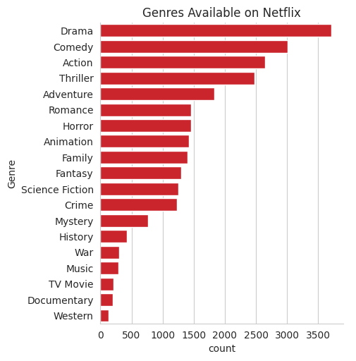
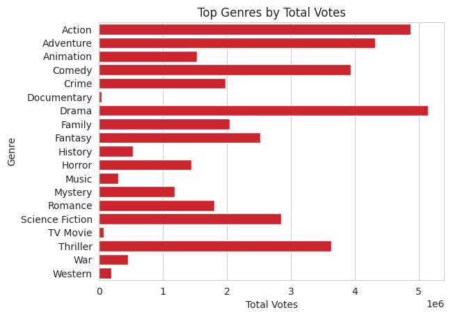
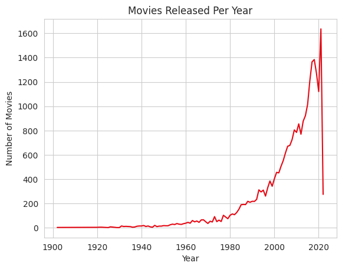

# Netflix Data Analysis Project

## Project Overview

This project analyzes a Netflix movies dataset to uncover insights related to genres, popularity, ratings, and release trends. The analysis demonstrates key data science steps including data cleaning, transformation, exploration, and visualization.
---

## Dataset Description

The dataset initially contained the following columns:

- **Release_Date** – The release date of the movie  
- **Title** – Name of the movie  
- **Overview** – Brief description or summary of the movie  
- **Popularity** – Popularity score assigned to the movie  
- **Vote_Count** – Total number of votes received  
- **Vote_Average** – Average rating of the movie  
- **Original_Language** – Original language of the movie  
- **Genre** – Genre(s) of the movie (comma-separated values)  
- **Poster_Url** – URL link to the movie poster  

---

## Objectives

* Identify the most frequent genre in the dataset
* Determine which genre has the highest number of votes
* Find the most popular movies along with their genres
* Find the least popular movies along with their genres
* Identify the year with the highest number of movie releases

---

## Exploration Summary

* The dataset consists of **9,827 rows and 9 columns**
* No missing values or duplicate records were found
* The **`Release_Date`** column was converted to datetime format and year was extracted
* Unnecessary columns such as **`Overview`**, **`Original_Language`**, and **`Poster_Url`** were removed
* The **`Popularity`** column contains some outliers
* The **`Vote_Average`** column was categorized for better analysis
* The **`Genre`** column contained comma-separated values and extra spaces, which were cleaned and normalized using `split()` and `explode()`
* After normalization, the dataset expanded from **9,827 rows to 25,552 rows**

---

## Tools & Technologies

* Python
* Pandas
* NumPy
* Matplotlib
* Seaborn

---

## Exploratory Data Analysis

The following analyses were performed:

* Genre distribution
* Vote count and popularity analysis
* Rating categorization
* Year-wise movie release trends
* Identification of most and least popular movies

---

## Visualizations

* Genre distribution plot
* Rating category distribution
* Top genres by total votes
* Year-wise release trend

---

## Sample Visualizations

### Genre Distribution

### Top Genres by Votes

### Year-wise Trend

---

## Key Insights

* **Drama** is the most frequent genre in the dataset
* Drama also has the **highest total votes**, indicating strong audience engagement
* *Spider-Man: No Way Home* is the most popular movie and belongs to multiple genres (Action, Adventure, Science Fiction)
* The dataset shows a **peak in movie releases around 2020**
* Genre normalization significantly increased dataset size due to multi-genre entries

---

## Conclusion

This project highlights how genre influences both the frequency and popularity of Netflix content. Drama emerges as the dominant genre, while recent years show increased content production. The analysis demonstrates a complete data science workflow from data cleaning to visualization.

---

## Authors
- **Mohammad Alkama** – BCA (DS & AI), 2nd Year  
 
